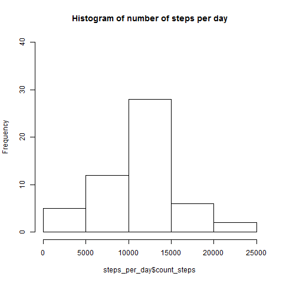
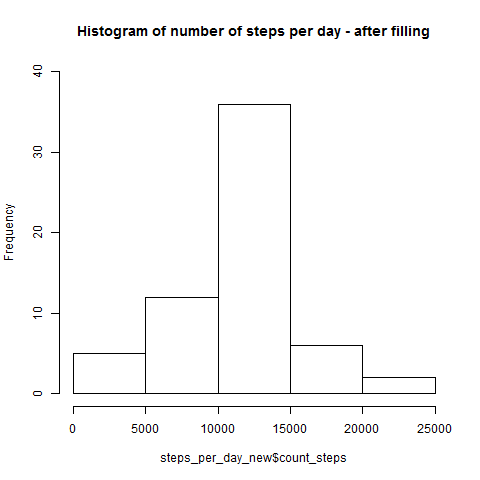
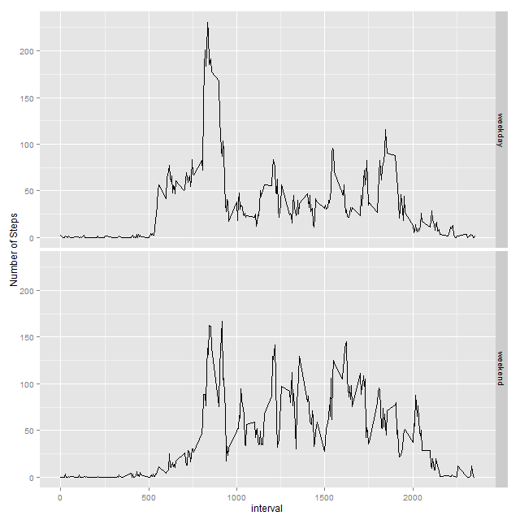

## Loading and preprocessing the data

```{r}
library(ggplot2)
## Changing directory/language and reading file
current_dir <- getwd()
##work_dir <- "C:/New_Documents/Cursos_Big_Data/Reproducible/Assign1"
work_dir <- "C:/R_Programming/Reproducible/Git/RepData_PeerAssessment1"
setwd(work_dir)
current_language <- Sys.getlocale("LC_TIME")
Sys.setlocale("LC_TIME", "English")

activity <- read.csv("activity.csv")

## Creating and filling new column "day"
total_count <- nrow(activity)
days <- vector(mode="numeric", length=17568)
current_date = "0000-00-00"
current_day = 0
for (i in 1:total_count) 
{ 
  if (activity$date[i] != current_date) 
  {
      current_date <- activity$date[i]
      current_day <- current_day + 1
  }
  days[i] <- current_day
}
activity$day <- days
```

## What is mean total number of steps taken per day?

```{r}
## Summarizing and calculating total number of steps per day
steps_per_day <- aggregate(activity$steps, by=list(activity$day), FUN=sum)
names(steps_per_day) <- c("day","count_steps")

## Plotting histogram
png(filename="figures/hist.png", width = 480, height = 480)
hist(steps_per_day$count_steps, ylim=c(0,40))
dev.off()
```



```{r}
## Calculating mean and median
mean_steps <- mean(steps_per_day$count_steps, na.rm=TRUE)
median_steps <- median(steps_per_day$count_steps, na.rm=TRUE)
```

### ---> Mean: `r format(round(mean_steps, 2), nsmall = 2)`
### ---> Median: `r median_steps`

## What is the average daily activity pattern?

```{r}
## Summarizing and calculating mean number of steps per 5-minute interval
steps_per_interval <- aggregate(activity$steps, by=list(activity$interval), FUN=mean, na.rm=TRUE)
names(steps_per_interval) <- c("interval","mean_interval")

## Line Plot
with(steps_per_interval, plot(interval, mean_interval, type="l"))
```

```{r}
## Finding maximum interval
maximum_interval_mean <- max(steps_per_interval$mean_interval)
maximum_interval <- 
    steps_per_interval$interval[steps_per_interval$mean_interval == maximum_interval_mean]
```

### ---> Interval with maximum average number of steps: `r maximum_interval`

## Imputing missing values

### Strategy for filling:
### The missing values were replaced by the mean values calculated for each 5-minute interval

```{r}
## Number of rows with NA
rows_with_na <- length(activity$steps[is.na(activity$steps)])

## New dataset to be filled
activity_new <- activity

## Filling missing values with interval means
for (i in 1:total_count)
  if (is.na(activity_new$steps[i])) activity_new$steps[i] <- 
           steps_per_interval$mean_interval[steps_per_interval$interval==activity_new$interval[i]]
```


```{r}
## Summarizing and calculating total number of steps per day
steps_per_day_new <- aggregate(activity_new$steps, by=list(activity_new$day), FUN=sum)
names(steps_per_day_new) <- c("day","count_steps")

## Plotting histogram after filling
png(filename="figures/hist_fill.png", width = 480, height = 480)
hist(steps_per_day_new$count_steps, ylim=c(0,40))
dev.off()
```



```{r}
## Calculating new mean and median
mean_steps_new <- mean(steps_per_day_new$count_steps, na.rm=TRUE)
median_steps_new <- median(steps_per_day_new$count_steps, na.rm=TRUE)
```

### ---> Mean: `r format(round(mean_steps_new, 2), nsmall = 2)`
### ---> Median: `r format(round(median_steps_new, 2), nsmall = 2)`

### The mean value remains the same, because the NA's were replaced by the mean values for each interval, so that the total number for each day with missing values will be exactly the mean.
### However, the median changed, and now its value is equal to the mean, as the total numbers for all those missing data days became the same.
### Regarding the histogram, it may be seen that the center range (10000-15000), which contains the mean value, has a higher frequency, because there are more days with the average number os steps

## Are there differences in activity patterns between weekdays and weekends?

```{r}
## Adding new factor to dataset activity_new
for (i in 1:total_count)
  if (weekdays(as.Date(activity_new$date[i]),abbreviate=TRUE) %in% c("Sat","Sun"))
      activity_new$weekfactor[i] <- "weekend" else
      activity_new$weekfactor[i] <- "weekday"

## Summarizing and calculating mean number of steps per weekday/weekend and 5-minute interval
steps_per_interval_weekfactor <- 
      aggregate(activity_new$steps, by=list(activity_new$weekfactor,activity_new$interval), 
                FUN=mean, na.rm=TRUE)
names(steps_per_interval_weekfactor) <- c("weekfactor","interval","mean_steps")
```

```{r}
## Plotting panel
png(filename="figures/panel.png", width = 640, height = 640)
qplot(interval,mean_steps,data=steps_per_interval_weekfactor,facets=weekfactor~.,
      geom="line",ylab="Number of Steps")
dev.off()
```



### As shown by the plot above, there are significant differences in activity patterns between weekdays and weekends

```{r}
## Recover directory and language
setwd(current_dir)
Sys.setlocale("LC_TIME", current_language)
```
